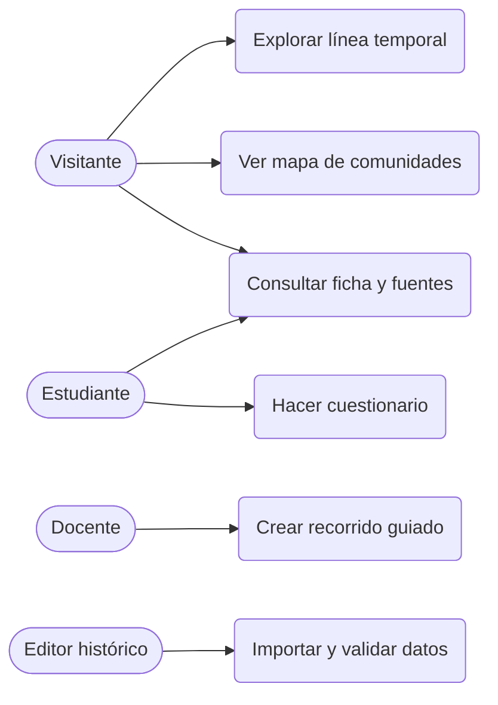

# Análisis de requisitos

## 1. Descripción del problema

La historia de la Iglesia Primitiva está repartida entre libros, mapas y cronologías difíciles de relacionar entre sí. Los estudiantes necesitan una herramienta que conecte **personas, lugares, acontecimientos y fuentes** en un solo entorno, y que además indique qué tan fiable es cada dato.

## 2. Actores

| Actor | Descripción |
|---|---|
| Visitante | Persona que consulta el atlas sin registrarse |
| Estudiante | Usuario que guarda favoritos y realiza cuestionarios |
| Docente | Prepara recorridos guiados para sus clases |
| Editor histórico | Da de alta y revisa el contenido, comprobando las fuentes |

## 3. Requisitos funcionales

| ID | Requisito | Prioridad |
|---|---|---|
| RF-01 | Mostrar una **línea temporal** navegable de c. 30 a 325 d. C. | Alta |
| RF-02 | Mostrar un **mapa del Mediterráneo** con las comunidades cristianas (Jerusalén, Antioquía, Éfeso, Corinto, Filipos, Roma, Alejandría, etc.) | Alta |
| RF-03 | Mostrar las **rutas de los viajes misioneros de Pablo** etapa por etapa | Alta |
| RF-04 | Consultar la **ficha de una persona** (Pedro, Pablo, Santiago, Esteban, Bernabé, Ignacio, Policarpo, Justino, Ireneo…) con sus datos y hechos | Alta |
| RF-05 | Consultar la **ficha de un acontecimiento** (Pentecostés, Concilio de Jerusalén, persecución de Nerón…) con lugar, participantes y fuentes | Alta |
| RF-06 | Filtrar acontecimientos por rango de años y por tipo | Alta |
| RF-07 | Consultar cada dato con su **fuente primaria** y su **nivel de certeza** de fecha (exacta, aproximada, tradicional) | Alta |
| RF-08 | Consultar un **glosario** (apóstol, diácono, obispo, catecúmeno, ágape, gnosticismo, canon…) | Media |
| RF-09 | Buscar por texto en personas, lugares, eventos y fuentes | Media |
| RF-10 | Realizar **cuestionarios** de autoevaluación por periodo | Media |
| RF-11 | Que el docente cree **recorridos guiados** (secuencia de eventos con notas) | Baja |
| RF-12 | Que el editor importe y valide datos en formato JSON | Baja |

## 4. Requisitos no funcionales

| ID | Requisito |
|---|---|
| RNF-01 | **Rigor histórico**: ningún evento se publica sin al menos una fuente asociada |
| RNF-02 | **Rendimiento**: la primera carga tarda menos de 3 s en una conexión estándar |
| RNF-03 | **Accesibilidad**: cumple el nivel AA de WCAG 2.1 (contraste, teclado, textos alternativos) |
| RNF-04 | **Adaptabilidad**: funciona en móvil, tableta y escritorio |
| RNF-05 | **Idioma**: interfaz y contenido en español, con estructura preparada para más idiomas |
| RNF-06 | **Despliegue estático**: se publica sin servidor propio (GitHub Pages) |
| RNF-07 | **Mantenibilidad**: los datos históricos viven en archivos JSON, separados del código |

## 5. Reglas de negocio

1. Todo evento y toda persona deben indicar su **nivel de certeza** de fecha.
2. Las tradiciones no atestiguadas en fuentes antiguas (por ejemplo, detalles del martirio de Pedro y Pablo) se marcan como **tradición**.
3. Los años se guardan como enteros (los años d. C. son positivos). Los rangos aproximados guardan año inicial y final (por ejemplo, Concilio de Jerusalén: 48-50).
4. Un viaje misionero está formado por etapas ordenadas, cada una asociada a un lugar.

## 6. Historias de usuario

- **HU-01** Como estudiante, quiero ver en el mapa por qué ciudades pasó Pablo en su segundo viaje, para entender cómo llegó el cristianismo a Europa.
- **HU-02** Como estudiante, quiero saber si la fecha de un suceso es segura o aproximada, para no memorizar como exacto algo debatido.
- **HU-03** Como docente, quiero filtrar los eventos entre los años 60 y 70, para preparar una clase sobre Nerón y la guerra judía.
- **HU-04** Como editor, quiero que el sistema rechace un evento sin fuentes, para mantener la calidad del contenido.

## 7. Criterios de aceptación (ejemplos)

| Historia | Criterio |
|---|---|
| HU-01 | Dado el segundo viaje, cuando lo selecciono, entonces veo en orden las etapas Listra, Filipos, Tesalónica, Atenas y Corinto, entre otras |
| HU-03 | Dado el filtro 60-70, entonces aparecen la persecución de Nerón y la destrucción del Templo, y no aparece el Concilio de Jerusalén |
| HU-04 | Dado un evento sin fuentes, cuando intento guardarlo, entonces recibo un error de validación |

## 8. Casos de uso principales

## 9. Riesgos

| Riesgo | Impacto | Mitigación |
|---|---|---|
| Presentar como cierto un dato debatido | Alto | Campo obligatorio de certeza y de fuente |
| Sesgo confesional en las descripciones | Medio | Redacción descriptiva y separación entre fuente y tradición |
| Datos geográficos imprecisos (ciudades antiguas) | Medio | Guardar coordenadas aproximadas y nombre antiguo y moderno |
