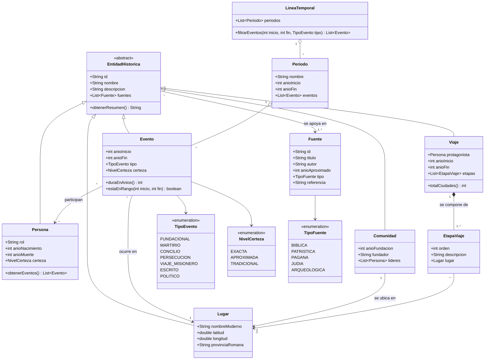

# Diagrama de clases

El dominio gira en torno a cuatro ideas: **quién** (Persona), **dónde** (Lugar y Comunidad), **qué pasó** (Evento, Viaje) y **cómo lo sabemos** (Fuente).

## Diagrama

:::info Renderizado de Mermaid
Para que Docusaurus dibuje los diagramas hay que instalar `@docusaurus/theme-mermaid` y activar `markdown: { mermaid: true }` y `themes: ['@docusaurus/theme-mermaid']` en `docusaurus.config.js`. Sin esto se mostrará el código del diagrama.
:::

## Descripción de las clases

| Clase | Responsabilidad |
|---|---|
| `EntidadHistorica` | Clase abstracta con los datos comunes (id, nombre, descripción) y la lista de fuentes que respaldan a la entidad |
| `Persona` | Personaje histórico: apóstoles, misioneros, obispos, apologistas, mártires |
| `Lugar` | Ciudad o región con coordenadas y provincia romana |
| `Comunidad` | Iglesia local en un lugar (Jerusalén, Antioquía, Éfeso, Corinto, Roma…) |
| `Evento` | Acontecimiento con rango de años, tipo, lugar y participantes |
| `Viaje` | Recorrido misionero compuesto por etapas ordenadas |
| `Fuente` | Documento antiguo que respalda un dato (Hechos, 1 Clemente, Tácito…) |
| `Periodo` / `LineaTemporal` | Agrupan los eventos para la navegación cronológica |

## Ejemplos de instancias

| Objeto | Clase | Datos clave |
|---|---|---|
| Pablo de Tarso | `Persona` | Rol: apóstol de los gentiles. Muerte c. 64-67 (`TRADICIONAL`) |
| Antioquía de Siria | `Comunidad` | Donde los discípulos fueron llamados «cristianos» por primera vez |
| Concilio de Jerusalén | `Evento` | Años 48-50, tipo `CONCILIO`, participantes Pedro, Santiago, Pablo y Bernabé, fuente Hechos 15 |
| Persecución de Nerón | `Evento` | Año 64, tipo `PERSECUCION`, lugar Roma, fuente Tácito, *Anales* 15,44 |
| Segundo viaje misionero | `Viaje` | c. 49-52; etapas por Asia Menor, Filipos, Tesalónica, Atenas, Corinto |
| Didaché | `Fuente` | Tipo `PATRISTICA`, aprox. finales del s. I o principios del II |

## Decisiones de diseño

1. **Herencia** desde `EntidadHistorica` para que todas las entidades tengan fuentes y puedan mostrarse con un mismo componente de ficha.
2. **Composición** entre `Viaje` y `EtapaViaje`: una etapa no tiene sentido fuera de su viaje.
3. **Enumeraciones** para el tipo de evento, la certeza y el tipo de fuente, evitando cadenas libres.
4. Los eventos guardan **año inicial y final**, lo que permite modelar fechas aproximadas como el Concilio de Jerusalén (48-50).
