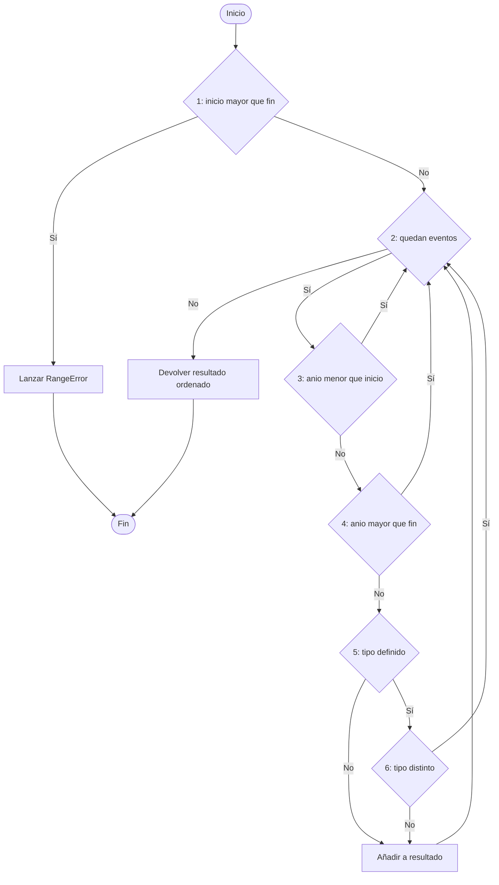

# Análisis de caja blanca

Las pruebas de **caja blanca** se diseñan a partir del código fuente. Aquí analizamos la función `filtrarEventos`, que implementa el requisito **RF-06** (filtrar eventos por rango de años y por tipo).

## 1. Código analizado

```ts
export function filtrarEventos(
  eventos: Evento[],
  inicio: number,
  fin: number,
  tipo?: TipoEvento
): Evento[] {
  if (inicio > fin) {                              // (1)
    throw new RangeError("El año inicial no puede superar al final");
  }
  const resultado: Evento[] = [];
  for (const e of eventos) {                       // (2)
    if (e.anioInicio < inicio || e.anioInicio > fin) {   // (3) y (4)
      continue;
    }
    if (tipo !== undefined && e.tipo !== tipo) {   // (5) y (6)
      continue;
    }
    resultado.push(e);
  }
  return resultado.sort((a, b) => a.anioInicio - b.anioInicio);
}
```

## 2. Grafo de flujo de control



## 3. Complejidad ciclomática

Se cuentan las condiciones simples: (1), (2), (3), (4), (5) y (6), es decir, 6 nodos predicado.

- Por predicados: V(G) = P + 1 = 6 + 1 = **7**
- Por aristas y nodos: V(G) = A - N + 2 = 16 - 11 + 2 = **7**

Hacen falta **7 caminos independientes**, por lo que se necesitan al menos 7 casos de prueba para cubrirlos.

## 4. Datos de prueba

| Id | Evento | Año | Tipo |
|---|---|---|---|
| E1 | Pentecostés | 30 | FUNDACIONAL |
| E2 | Martirio de Esteban | 35 | MARTIRIO |
| E3 | Concilio de Jerusalén | 49 | CONCILIO |
| E4 | Persecución de Nerón | 64 | PERSECUCION |
| E5 | Destrucción del Templo | 70 | POLITICO |

## 5. Caminos independientes y casos de prueba

| Camino | Recorrido | Entrada | Resultado esperado |
|---|---|---|---|
| CP1 | 1(sí) → error | `[E1]`, inicio 70, fin 30 | Lanza `RangeError` |
| CP2 | 1(no) → 2(no) | `[]`, 30, 70 | `[]` |
| CP3 | 2(sí) → 3(sí) → 2(no) | `[E1]`, 40, 70 | `[]` (30 es menor que 40) |
| CP4 | 3(no) → 4(sí) | `[E5]`, 30, 64 | `[]` (70 es mayor que 64) |
| CP5 | 4(no) → 5(no) → añadir | `[E3]`, 30, 70 | `[E3]` |
| CP6 | 5(sí) → 6(sí) | `[E2]`, 30, 70, `CONCILIO` | `[]` |
| CP7 | 5(sí) → 6(no) → añadir | `[E3]`, 30, 70, `CONCILIO` | `[E3]` |

Con estos siete casos se logra **cobertura de sentencias, de decisiones (ramas) y de condiciones** de la función.

## 6. Implementación de las pruebas (Vitest)

```ts
import { describe, it, expect } from "vitest";
import { filtrarEventos } from "../src/services/filtrarEventos";

const mk = (id: string, anio: number, tipo: any) => ({
  id, nombre: id, descripcion: "", anioInicio: anio, anioFin: anio,
  tipo, certeza: "APROXIMADA", lugarId: "", personasIds: [], fuentesIds: ["x"],
});

const E1 = mk("pentecostes", 30, "FUNDACIONAL");
const E2 = mk("esteban", 35, "MARTIRIO");
const E3 = mk("concilio", 49, "CONCILIO");
const E4 = mk("nerón", 64, "PERSECUCION");
const E5 = mk("templo", 70, "POLITICO");

describe("filtrarEventos (caja blanca)", () => {
  it("CP1: rango inválido lanza error", () => {
    expect(() => filtrarEventos([E1], 70, 30)).toThrow(RangeError);
  });
  it("CP2: lista vacía devuelve vacío", () => {
    expect(filtrarEventos([], 30, 70)).toEqual([]);
  });
  it("CP3: descarta eventos anteriores al rango", () => {
    expect(filtrarEventos([E1], 40, 70)).toEqual([]);
  });
  it("CP4: descarta eventos posteriores al rango", () => {
    expect(filtrarEventos([E5], 30, 64)).toEqual([]);
  });
  it("CP5: incluye evento en rango sin filtrar por tipo", () => {
    expect(filtrarEventos([E3], 30, 70)).toEqual([E3]);
  });
  it("CP6: descarta evento de otro tipo", () => {
    expect(filtrarEventos([E2], 30, 70, "CONCILIO")).toEqual([]);
  });
  it("CP7: incluye evento del tipo pedido", () => {
    expect(filtrarEventos([E3], 30, 70, "CONCILIO")).toEqual([E3]);
  });
  it("Extra: devuelve los eventos ordenados por año", () => {
    expect(filtrarEventos([E5, E3, E1], 30, 70)).toEqual([E1, E3, E5]);
  });
});
```

## 7. Conclusiones

- La función tiene una complejidad ciclomática de 7, por debajo del umbral habitual de 10, por lo que es mantenible.
- Los 7 caminos independientes están cubiertos por los casos CP1 a CP7.
- El caso extra verifica el ordenamiento cronológico, que no añade ramas, pero es importante para la línea temporal.
